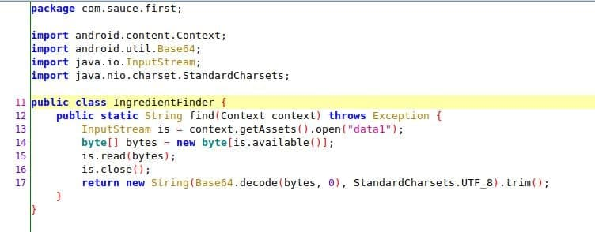
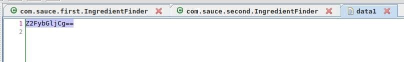
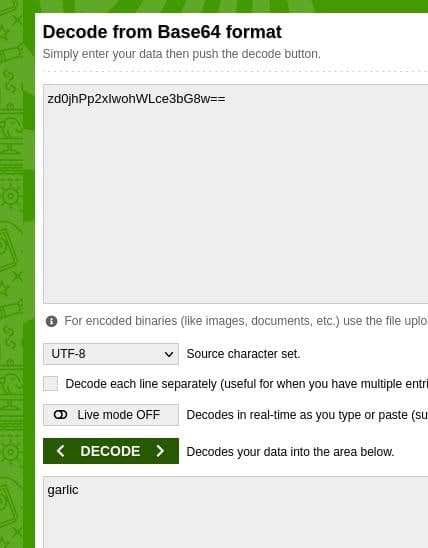
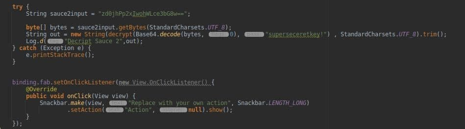
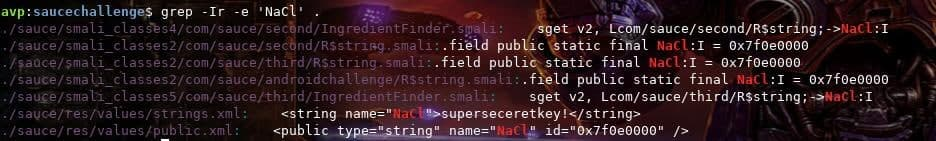
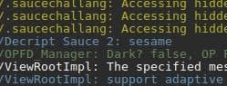
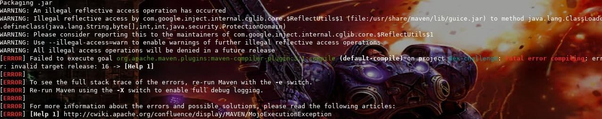
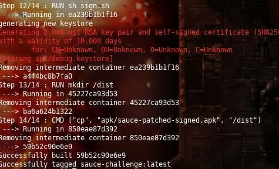

## Sauce ingredient one

Only with jadx, I decompiled the apk, and looking for the first ingredient on assets and decompiled with a web tool:

### Method:

### Asset:

### Decode base 64:

### Ingredient
garlic

## Sauce ingredient two

I try with the same tools on the first ingredient but I have some issues with the String password and OpenSSL tool, for this reason I changed to `apktool` and found the password, and I writed a simple java project for run that:

### Method on the new project for desencript:

### Password:

### Output

### Ingredient
sesame

## Sauce ingredient three

I first try to run the script but with some issues:

### Running docker:

